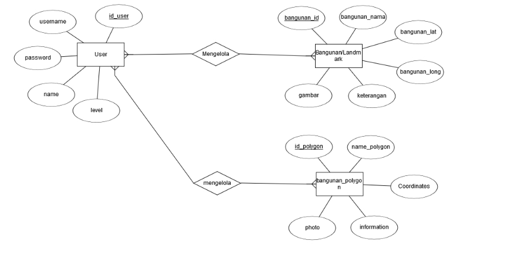

# Web GIS

## Introduction
Geographic Information System based on web. Made with Code Igniter 3 and Leaflet.

Features of this web app:
1. CRUD Marker on MAP <br>
2. CRUD Polygon on MAP <br>
3. CRUD User <br>
4. 3 level of user (admin, operator and regular user) <br>
5. Login <br>
6. Logout <br>
7. Register <br>
8. Profile Page <br>
9. Export data landmark to Excel <br>
10. Export data user to Excel <br>
11. Add photo on marker
11. Add photo on polygon

## Installation
1. Clone or download this repositroy <br>
2. Put the web_gis folder into htdocs folder on xampp or www folder on wamp <br>
3. Create database name web_gis <br>
4. Import the .sql file into phpmyadmin or other MySql DBMS<br>
5. Finally, run the program in your browser localhost. Example:
```bash
http://localhost/web_gis/
```

## ERD


